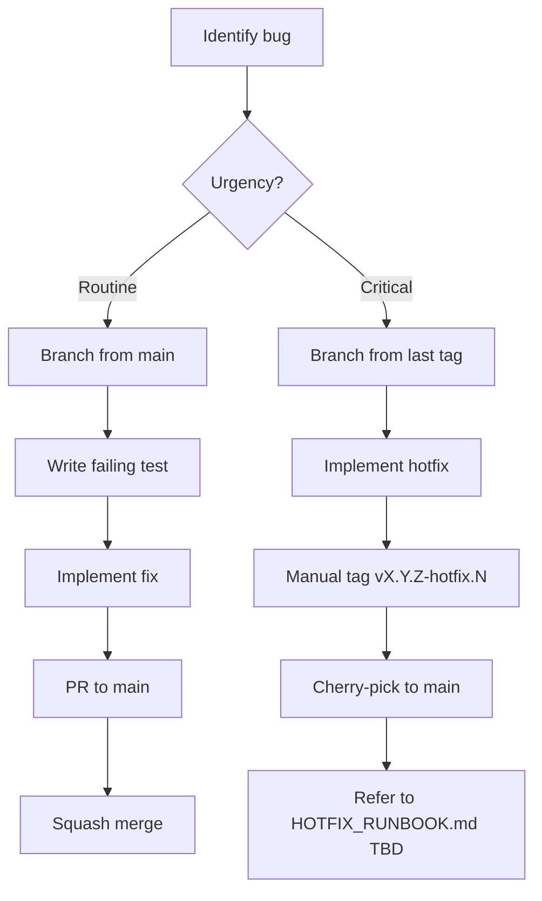
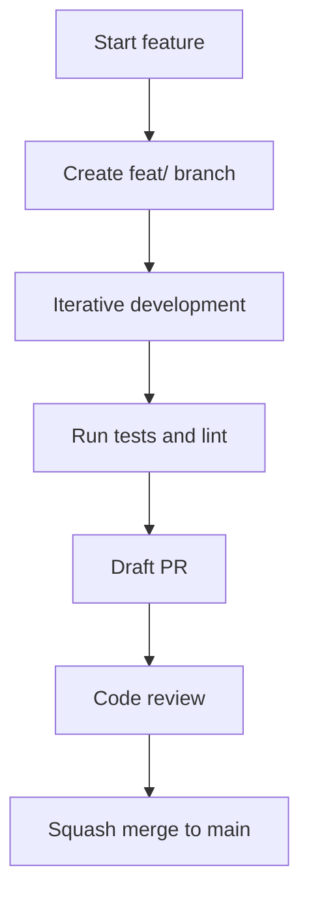
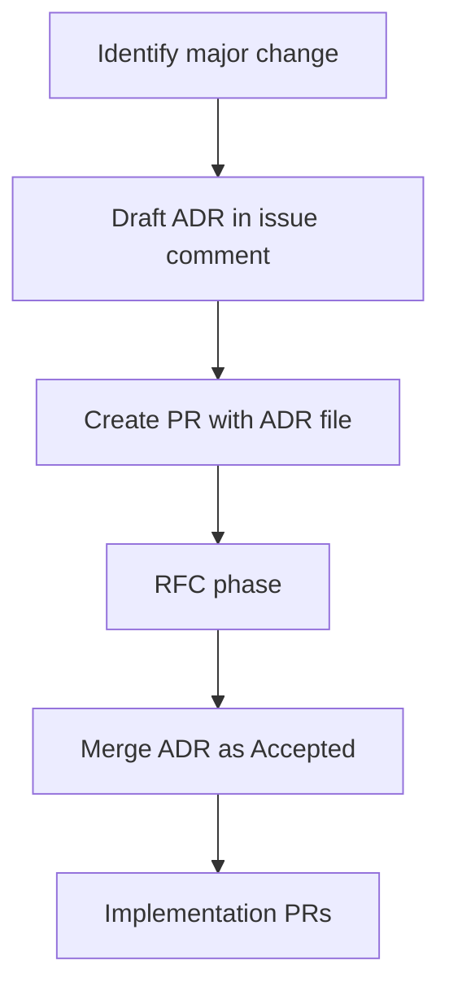

# Git Flow

## Purpose and scope

This document defines the branching, commit, and release strategies for the mcp-hangar project.
It covers routine development, bug fixes, feature implementation, and administrative flows.
Adherence ensures a clean, searchable history and reliable automation.

This document does not cover Architectural Decision Record (ADR) governance.
ADR governance rules reside in docs/adr/AGENTS.md.
General repository conventions, such as language requirements and source layout, are in the root AGENTS.md.
External contributors should also consult CONTRIBUTING.md for environment setup.

Rules defined here are currently considered soft-law for the v0.x lifecycle.
Most conventions are not yet machine-enforced by CI.
Formal enforcement details are tracked in Section 12.

## Decision log

The following table tracks the evolution of git and workflow standards.

| # | Original recommendation | Final decision | Reasoning |
|---|-------------------------|----------------|-----------|
| 1 | Merge strategy | squash-merge by default | - |
| 2 | Issue # in branch name | optional (not required) | - |
| 3 | Discussions categories | defer until sustained external traffic exists | Original proposed 4 categories. Final decision defers implementation to avoid maintaining empty forums while traffic is low. |
| 4 | Stale bot | 180-day for v0.x, drop to 90d post-1.0 | v0.x requires more flexibility for experimental features. Post-1.0 will tighten to 90 days for higher maintenance standards. |
| 5 | CC scope list | 13 approved, 3 rejected, 1 deferred | Auth, events, and cqrs were collapsed into core or security to reduce noise. Proto deferred pending higher change frequency. |
| 6 | Release cadence | ad-hoc, release-please planned | - |
| 7 | Deprecation policy | pre-1.0 SemVer allows breaking in any minor | v0.x projects prioritize velocity over stability. ADR-008 will formalize the stricter post-1.0 policy later. |
| 8 | Dependabot auto-merge | auto-merge dev, actions, and runtime CVE patches | Runtime CVE patches are included in auto-merge to maintain security posture with minimal manual intervention. |
| 9 | ADR authorship | agents may draft, maintainer authors PR | - |
| 10 | Pre-release flow location | documented in this file (section 9) | - |
| 11 | Hotfix forward-port automation | deferred, manual cherry-pick | - |

## Branch naming and merge strategy

The project uses a squash-merge strategy for all pull requests.
This preserves a linear history while keeping individual feature commits grouped.
Branch names must follow a structured prefix pattern to support automation.

Standard prefixes:

- feat/<scope>-<slug> (new features)
- fix/<scope>-<slug> (bug fixes)
- perf/ (performance optimizations)
- refactor/ (code restructuring without behavior change)
- docs/ (documentation changes)
- test/ (test suite additions or modifications)
- build/ (build system or dependency changes)
- ci/ (continuous integration configuration)
- chore/ (routine maintenance)
- hotfix/<vX.Y.Z> (emergency fixes)

Tool-specific prefixes:

- dependabot/* (automated dependency updates)
- copilot/<task>-<slug> (AI assisted changes)
- release-please--* (automated release preparation)

Including issue numbers in branch names is optional but encouraged for complex fixes.

## Conventional Commits scope reference

Scopes provide context to the nature of a change.
They are used in commit messages: `<type>(<scope>): <subject>`.

| Scope | Description |
|-------|-------------|
| core | Logic in src/mcp_hangar/domain/ or application/ |
| enterprise | Logic in enterprise/ directory |
| cli | Command line interface and Typer registration |
| operator | Kubernetes operator components |
| helm | Helm chart templates and values |
| ui | Frontend or dashboard components |
| observability | Metrics, tracing, and logging infrastructure |
| security | Authentication, authorization, and secret management |
| docs | Markdown documentation and MkDocs config |
| deps | Dependency updates and lockfile changes |
| release | Release artifacts and versioning |
| infra | Dockerfile, Makefile, and local dev setup |
| tests | Test fixtures and suite configuration |

Rejected scopes:

- auth (collapse into security)
- events (collapse into core)
- cqrs (collapse into core)

Deferred:

- proto (revisit when protobuf change frequency justifies)

## Flow 1: Bug fix

Routine bug fixes target the main branch.
Critical production issues follow the hotfix sub-flow.

Hotfix branches must branch from the specific version tag where the bug exists.
Manual tagging is required before cherry-picking the fix back to the main branch.
Detailed operational steps are located in the HOTFIX_RUNBOOK.md placeholder.

## Flow 2: Feature

Features are developed in isolation and merged once they meet quality gates.

400 LOC is a rule of thumb / decomposition trigger, not a hard rule.
Some 600-LOC features are obvious; some 200-LOC features beg to be split.
Use judgment.

Feature flags are an option for multi-PR features.
They are not the default.
Flag infrastructure carries cost and should be used only when continuous integration requires it.

## Flow 3: Epic and ADR

Large architectural changes require a formal Decision Record before implementation.

### Pre-community Phase A fallback

Until the project has at least 5 active external contributors, Phase A may be conducted as a draft PR with `Status: Proposed` and label `rfc`, held open for a 5-14 day soak. GH Discussion is not required. If external comment arrives, incorporate. If not, proceed to merge after soak. Revisit this fallback when sustained Discussion traffic exists.

ADRs must be merged before implementation begins.
Once a status is set to `**Status:** Accepted` (per ADR-006 line 3), the ADR is immutable.
Changes require a new ADR that supersedes the old one with bidirectional references.
Agents may draft ADRs in issue comments but never author the PR.

### Decision Tree: Issue vs Discussion vs PR

| Question | Issue | Discussion | PR |
|----------|-------|------------|----|
| Is the decision known? | No | No | Yes |
| Do we need consensus? | Yes | Yes | No |
| Will this produce a mergeable artifact? | No | No | Yes |

## Pre-1.0 vs Post-1.0 deprecation policy

The project follows a two-stage deprecation policy depending on major version.

Pre-1.0:
SemVer permits breaking changes in any minor version.
This is an explicit policy to allow for rapid iteration on core domain models.
Consumers should pin to exact minor versions if they require stability.

Post-1.0:
Deprecations must be marked in at least one minor release.
Removal occurs earliest in the next major release.
ADR-008 will formalize this post-1.0 behavior.

## Pre-release flow

Pre-releases allow for testing artifacts in a controlled environment.
This is an operational workflow driven by tags.

Tagging `vX.Y.Z-rc.N` triggers .github/workflows/release.yml to publish to TestPyPI.
The project uses alpha, beta, and rc suffixes for lifecycle management.
Promoting a release to production is done by tagging `vX.Y.Z` (no -rc suffix).
This triggers the same workflow to publish the final artifact to PyPI.

Reference .github/workflows/release.yml for the specific logic of tag-driven publishing.

## Release cadence and process

Releases are currently ad-hoc based on feature readiness and security needs.
This follows the decision made in section 2, row 6.

The project plans to use release-please as a queue mechanism.
Currently, this tool is NOT installed.
The version-bump.yml workflow is the primary path for version management today.
Future automation for release notes and automated tagging is deferred to the parking lot.

## Hotfix process

Hotfixes are emergency releases to address critical production regressions or CVEs.
They bypass the standard feature flow to provide rapid resolution.

A hotfix branch is cut directly from the target version tag.
After verification, the fix is tagged and then cherry-picked into the main branch.
Detailed manual steps are in [HOTFIX_RUNBOOK.md](HOTFIX_RUNBOOK.md).

## Automation surface

### Active today

- enterprise-import-boundary (enforced in security.yml)
- pr-validation.yml (lint and basic unit tests)
- ci-core.yml (domain and application tests)
- ci-helm.yml (chart linting)
- ci-operator.yml (operator SDK tests)
- ci-docs.yml (MkDocs build validation)
- release.yml (TestPyPI and PyPI publishing)
- version-bump.yml (manual version management)
- security.yml (static analysis and boundary checks)

### Active after sibling tickets merge

- stale bot (stale.yml)
- Dependabot auto-merge (dependabot-automerge.yml)

### Soft-law (documented here, not auto-enforced -- parking lot)

- Conventional Commit types/scopes: violation caught by reviewer, not by CI.
- Squash convention: violation caught by reviewer, not by CI.
- Branch naming: violation caught by reviewer, not by CI.
- [Unreleased] CHANGELOG entry: violation caught by reviewer, not by CI.
- PR body sections: violation caught by reviewer, not by CI.
- Deprecation policy: violation caught by reviewer, not by CI.
